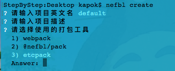

<p align='center'>
    <a href='https://etcpack.github.io/api' target='_blank'>
        
    </a>
</p>

# etcpack | 前端打包工具

<p>
  <a href="https://hai2007.gitee.io/npm-downloads?interval=7&packages=etcpack"></a>
  <a href="https://www.npmjs.com/package/etcpack"></a>
  <a href="https://github.com/etcpack/etcpack/blob/master/LICENSE"></a>
  <a href="https://github.com/etcpack/etcpack" target='_blank'></a>
</p>

## Issues
使用的时候遇到任何问题或有好的建议，请点击进入[issue](https://github.com/etcpack/etcpack/issues)！

## How to use?

如果你想快速试试，可以使用命令创建项目，[Nefbl框架](https://nefbl.github.io/api/)采用了此工具作为官方打包工具。

因此，首先，你需要安装cli工具：

```
npm install -g @nefbl/cli
```

然后，找个地方（比如桌面）执行生成命令：

```
nefbl create
```

根据提示依次输入项目名称、描述、选择打包工具等即可。



如上截图，请在选择打包工具的时候，选择```etcpack```这一项。

最后回车，即可得到一个空的基于```etcpack```打包的nefbl项目了（当然，打包别的框架或者无框架的项目也是可以的，只是需要修改对应的loader即可）。

具体的使用你可以[查阅文档](https://etcpack.github.io/api)哦~

欢迎你的加入，如果希望加入我们，请去[issue](https://github.com/etcpack/etcpack/issues)给我们留言。

## How to debug?

命令行进入```test```文件夹，然后执行：

```
npm run debug
```

在需要调试的地方提前添加“ debugger ”语句，这和普通的web端调试一样，接着，在chrome浏览器地址栏中输入：

```
chrome://inspect/#devices
```

接着，请点击“ Open dedicated DevTools for Node ”后进入调试界面。

开源协议
---------------------------------------
[MIT](https://github.com/etcpack/etcpack/blob/master/LICENSE)

Copyright (c) 2021-2022 [hai2007](https://hai2007.gitee.io/sweethome/) 走一步，再走一步。
